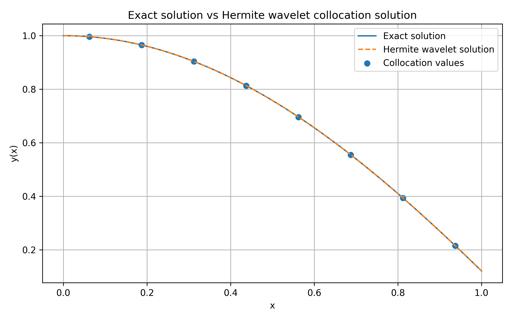
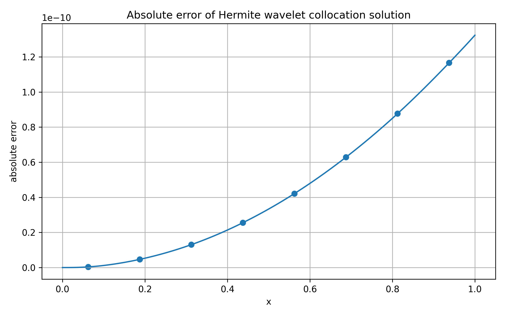

# Hermite Wavelet Collocation Method for a Third-Order ODE

This repository implements a Hermite wavelet collocation method in Python for solving a third-order ordinary differential equation.

The code builds Hermite wavelet basis functions, constructs the collocation system, solves for the wavelet coefficients, reconstructs the numerical solution by triple integration, and compares the result with the exact solution.

## Model Problem

The benchmark problem is

$$y'''(x)=3\sin(x), \qquad 0 \le x \le 1.$$

with initial conditions

$$y(0)=1, \qquad y'(0)=0, \qquad y''(0)=-2.$$

The exact solution is

$$y(x)=3\cos(x)+\frac{x^2}{2}-2.$$

## Method

The third derivative is approximated as

$$y_h'''(x)=\sum_{i=1}^{N_x}\sum_{j=0}^{M_x-1}c_{i,j}\psi_{i,j}(x).$$

At the collocation points, this gives

$$\Psi C=F.$$

After solving for the coefficient vector, the numerical solution is reconstructed using

$$Y_h=Y_{\mathrm{initial}}+P_3C.$$

## Numerical Results

### Exact solution vs Hermite wavelet solution



### Absolute error



## How to Run

Install the required Python packages:

```bash
pip install -r requirements.txt
```

Run the solver:

```bash
python hermite_wavelet_ode.py
```

## Repository Contents

```text
hermite-wavelet-collocation-ode/
├── README.md
├── LICENSE
├── requirements.txt
├── hermite_wavelet_ode.py
├── solution_comparison.png
├── absolute_error.png
└── docs/
    └── method_derivation.md
```

## Notes

This is a single-file scientific computing implementation designed for clarity and reproducibility.

The next extensions will include nonlinear ODEs, coupled ODE systems, heat equations, and physics-informed neural networks.
